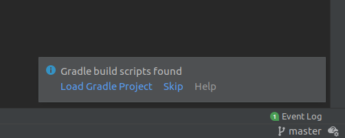
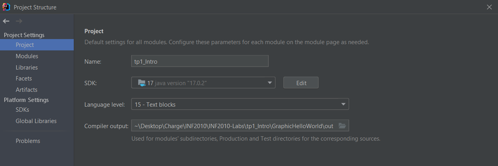
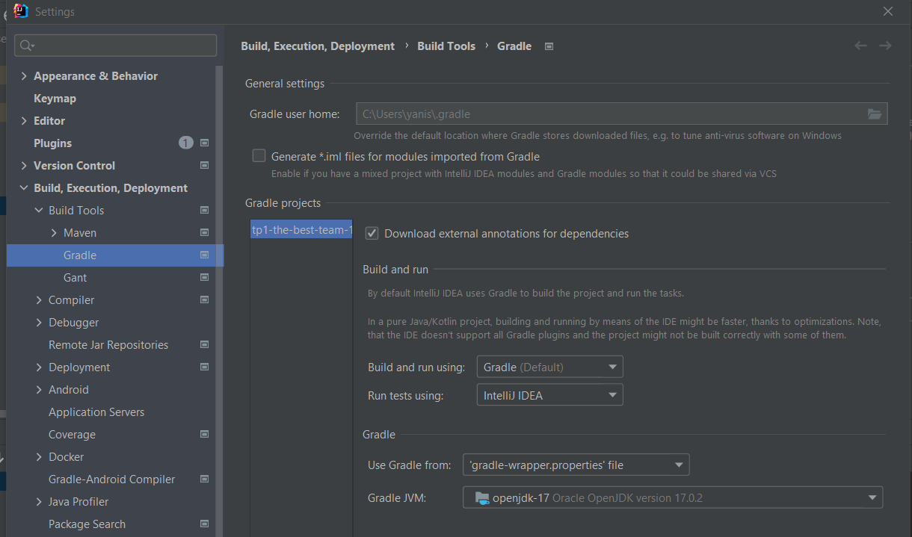
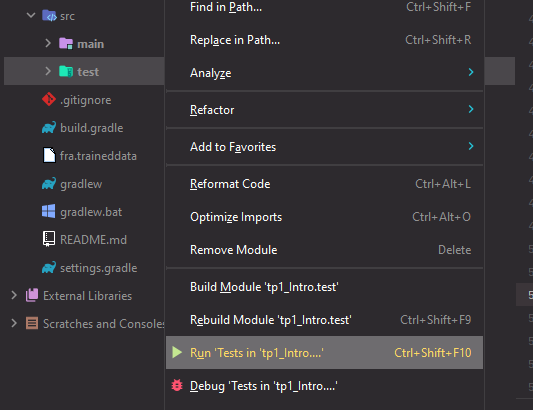
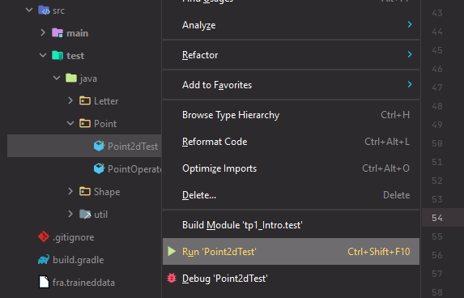
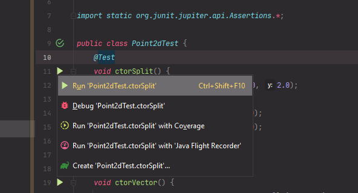
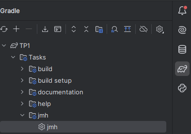

[](https://classroom.github.com/a/DOOvJNdL)

------------------------------------------------------------------------


<td><h1>INF2010 - Structures de données et algorithmes</h1></td>

Merci au cours INF3500 pour le format du Markdown

------------------------------------------------------------------------

Travail pratique \#1
====================

Introduction à Java et listes
=============================================================

Objectifs
---------

* Apprendre les bases de la programmation en Java

* Implémenter des structures de données séquentielles

* Analyser la performance de différentes structures de données selon le contexte d'utilisation


Préparation au laboratoire
--------------------------
Pour ce laboratoire, il est recommandé d’utiliser l’[IDE IntelliJ](https://www.jetbrains.com/fr-fr/idea/download/)
offert par JetBrains. Vous avez accès à la version complète (Ultimate) en tant qu’étudiant à Polytechnique Montréal.
Il suffit de vous créer un compte étudiant en remplissant le [formulaire d'inscription étudiante](https://www.jetbrains.com/shop/eform/students).

Astuces
-------
### Gradle
Le projet utilise Gradle pour gérer les *builds*. Après ouverture du projet, il est nécessaire d'importer le projet
Gradle à l'aide d'une fenêtre qui apparaîtra en bas à droite de votre écran.



Dans le cadre du laboratoire, les différentes *build configurations* nous permettront de générer des programmes
contenant les tests implémentés à l'aide de [JUnit](https://junit.org/junit5/).

### Configuration Java
Afin que le TP compile sans erreurs, vous devez vous assurer d'utiliser la version 17+ de Java SDK.
Pour ce faire aller dans File -> Project Structure. Ensuite, sous project SDK assurez-vous d'avoir
openjdk-17. Il est possible de l'installer avec Intellij en ouvrant le *dropdown* SDK puis en allant sur *Add SDK* et en cliquant sur *Download SDK*. Vous devrez aussi
sélectionner **15-Text blocks** comme **Project language level**.



### Exécution Individuelle des tests
Afin de pouvoir lancer les tests de manière individuelle, il faut vous assurer que votre configuration soit la suivante.
Aller dans File -> Settings -> Build, Execution, Deployment -> Build Tools -> Gradle. Assurer vous que vous avez
sélectionné **IntelliJ IDEA** dans la section **Run tests using** et que votre **Gradle JVM** soit **openjdk-17**



##### *Build configuration* pour tous les tests (ou un dossier en particulier)


##### *Build configuration* pour une classe en particulier


##### *Build configuration* pour un test en particulier



------------------------------------------------------------------------

Partie 1 : Implémentation de l'interface `List`
---------------

Sous `src/main/java/List`, une interface de `List` vous est fournie. Vous devrez l'implémenter par les 
classes `Vector` et `LinkedList` dont le squelette est déjà fait.

La classe `Vector` est un tableau à taille variable, tandis que `LinkedList` est une liste _simplement_ chainée.
Des informations sont fournies comme documentation de classe et pour chaque méthode dans les fichiers respectifs.

L'objectif de cette partie est de faire passer les tests de chacune des classes.
Les tests se trouvent sous `src/test/java/List`. 
Les tests de `ListTest` sont partagés et doivent donc passer pour chacune des classes à implémenter

------------------------------------------------------------------------
Partie 2: Stack & Queue
---

Sous `src/main/java/Queue` et `src/main/java/Stack` se trouvent des squelettes pour les classes `Stack` et `Queue`.
Celles-ci doivent être implémentées de manière à utiliser la `List` donnée dans le constructeur.
Cette [injection de dépendance](https://en.wikipedia.org/wiki/Dependency_injection) permet de faire varier l'implémentation
de la liste qui est utilisée afin d'obtenir une file ou une pile.

La classe `Stack` est une pile (LIFO, Last In First Out), tandis que `Queue` est une file (FIFO, First In First Out).
Des informations sont fournies comme documentation de classe et pour chaque méthode dans les fichiers respectifs.

L'objectif de cette partie est de faire passer les tests de chacune des classes.
Les tests se trouvent sous `src/test/java/Stack` et `src/test/java/Queue`.


------------------------------------------------------------------------
Partie 3 : Mesure de performance
----------------

Le but de cette partie est de comparer la performance des classes `Stack` et `Queue` selon l'implémentation de la 
`List` qui est utilisée. Des _benchmarks_ vous sont fournies afin de mesurer la performance de vos classes.

Les _benchmarks_ fournis mesurent les opérations suivantes pour une taille `n` donnée (nombre de répétitions): 
- `pop`: À partir d'une `Stack` de la taille donnée, `pop` `n` fois
- `push`: À partir d'une `Stack` vide, `push` `n` fois
- `dequeue`: À partir d'une `Queue` de la taille donnée, `dequeue` `n` fois
- `enqueue`: À partir d'une `Queue` vide, `enqueue` `n` fois

Il faut garder en tête que les temps obtenus dépendent de plusieurs facteurs comme votre ordinateur, 
les processus en arrière-plan, etc. Cependant, on peut comparer deux temps obtenus dans des conditions similaires.

Afin d'exécuter les _benchmarks_, aller dans l'onglet 'Gradle' à droite de l'IDE.
Sous Tasks > jmh, exécutez `jmh` en double cliquant ou avec un clique droit.



L'exécution pourrait prendre quelques minutes. Une fois l'exécution terminée, vous utiliserez le script python
fourni afin de générer les graphiques des résultats.

Commencez par [créer et activer un environnement virtuel python](https://packaging.python.org/en/latest/guides/installing-using-pip-and-virtual-environments/)
et installez les dépendances avec
```shell
pip install -r requirements.txt
```

Exécutez le script `graph.py` fourni
```shell
python graph.py
```

Enregistrez les images sur votre ordinateur et incluez-les pour appuyer vos propos dans votre rapport (Partie 4).

------------------------------------------------------------------------
Partie 4 : Analyse des résultats
----------------

Pour chacun des graphiques produits (donc pour chaque _benchmark_), répondez aux questions suivantes :
- #### Est-ce qu'une des implémentations de `List` est moins performante que l'autre? Si oui, expliquez pourquoi
- #### Si vous avez répondu oui, est-il possible de modifier l'implémentation afin de la rendre plus performante? expliquez comment si applicable.

_N'oubliez pas d'appuyer vos propos avec les images générées à la partie précédente_

Votre rapport doit contenir une page titre avec :
- Le [logo de polytechnique](https://www.polymtl.ca/salle-de-presse/logos-et-normes-graphiques)
- Le nom et sigle du cours
- Un titre
- Votre section de laboratoire
- Vos noms et matricules
- La date de remise

------------------------------------------------------------------------

Barème de correction
--------------------

|                               |     |
|-------------------------------|-----|
| Vector                        | /5  |
| LinkedList                    | /5  |
| Queue                         | /2  |
| Stack                         | /2  |
| Analyse des résultats         | /5  |
| Qualité du code et du rapport | /1  |
| Total                         | /20 |


**Correction automatique** : Les tests sont un bon moyen d'évaluer votre note avant la remise. Néanmoins, l’entièreté
de votre code sera révisée par un chargé de laboratoire pour s'assurer qu'il réalise véritablement les tâches demandées.
Il peut donc y avoir des différences entre la note donnée par vos tests et votre note finale.

### Qu'est-ce que du code de qualité ?
Veuillez visiter [ce lien](https://docs.google.com/document/d/12YDr57UofDKu5mCJBSYhOQ1yibLu6K0s8xAbMj3_SGg/edit?usp=sharing) pour voir des erreurs communes à éviter. 
* Absence de code dédoublé (FAITES DES FONCTIONS!!!)
* Absence de *warnings* à la compilation
* Absence de code mort : Code en commentaire, variable inutilisé, etc...
* Respecte les mêmes conventions de codage dans tout le code produit
  * Langue utilisée
  * Noms des variables, fonctions et classes
* Variables, fonctions et classes avec des noms pertinents et clairs qui expliquent leur intention et non leur comportement
* Pas de code du type :
```java
class Example {
  //Exemple de mauvais code
  private static boolean foo(Integer x) {
    if (x > 10)
      return true;
    else
      return false;
  }

  //Exemple de bon code
  private static boolean foo(Integer x) {
    return x > 10;
  }
}
```
**Petite astuce:** Utiliser les fonctionnalités offertes par Intellij!

---

Le dernier commit de votre répertoire sera utilisé comme remise finale.

Bonne chance 🚀

